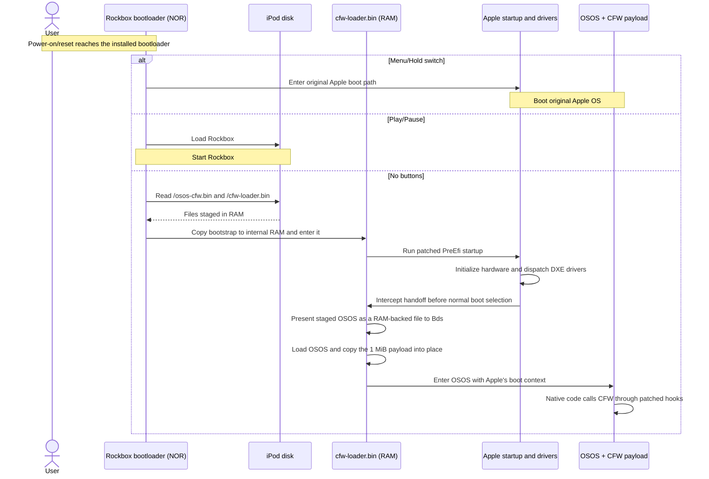

# Boot sequence

The patched Rockbox bootloader selects the system at startup:

| Controls | System |
| --- | --- |
| No buttons | RepriseOS |
| Menu or Hold switch | Original Apple OS |
| Play/Pause | Rockbox |

## RepriseOS boot

The companion adapts Apple's startup and image-loading path to the decrypted
firmware. Its Apple code patches live in RAM. Compatible companion, OSOS, and
bootloader builds share the file-loading and memory interface.

## Current memory layout

The payload occupies 1 MiB at `0x08b33000`. The OSOS patch moves the heap start
to `0x08c33000`, and the companion copies the appended payload into that reservation.

Source: [bootloader patch](../patches/rockbox/0001-cfw-file-boot.patch),
[Apple companion](../loader/apple/), [OSOS patcher](../patches/osos/patch_osos_payload.py),
[payload](../payload/).
