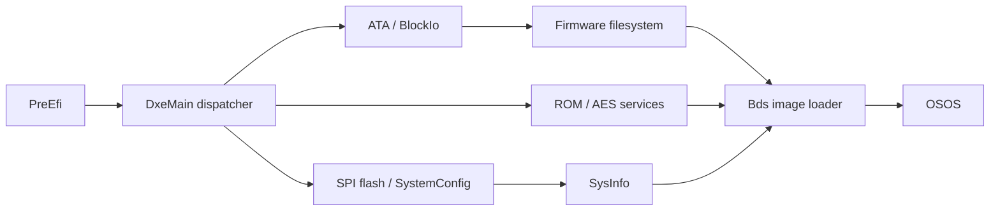

# NOR bootloader

Classic 7G Rev B / Apple 2.0.4. Module offsets below refer to extracted PE files,
not NOR offsets or relocated runtime addresses.

## Layout and startup

The 1 MiB NOR contains the primary image at flash offset `0x8000`, with a
`0x800`-byte header and `0x1f800`-byte encrypted body. The plaintext's EFI volume
starts at `0x100`, has length `0x1f700`, and contains 40 PE32 images, one TE image
and one padding entry. Most drivers use EFI type-1 compression. `0x20000000`
is BootROM, not NOR flash.

The loader body runs at `0x22000000`. Initial ARM branches reach `0x2201f7d0`,
then `0x2201f634`, then Thumb PreEfi at `0x2201054d`. PreEfi prepares memory;
DxeMain dispatches drivers as their protocol dependencies become available.

## Drivers and interfaces

| Module | Known behavior and offsets |
| --- | --- |
| DxeMain | Dispatcher `+0x6fc`; StartImage `+0x582a`. Global `+0x714c` points to the system table, whose `+0x3c` is BootServices. LocateProtocol is BootServices `+0xac`. |
| Ata | Entry `+0x2e6` powers/resets the controller and runs IDENTIFY. Success installs BlockIo at module `+0x2828`, GUID `964e5b21-6459-11d2-8e39-00a0c969723b`. |
| DxeSst25 | Entry `+0x4ca` initializes SPI. EWSR and WRSR(0) clear flash block protection. Skipping from `+0x522` to `+0x584` retains setup and protocol installation. |
| SystemConfig | Reads flash configuration and constructs `0x120`-byte SysInfo, including model, region and memory information. |
| IpodFirmwareFS | Read callback `+0x67c` uses 40-byte firmware-directory entries and DiskIO. These are named firmware images, not arbitrary FAT files. |
| FileSystemRead | Enumerates filesystem interfaces and supplies named image lookup to Bds. |
| Bds | Selector `+0x934`; image loader `+0x2e6`; final handoff `+0x4d2`. Selection includes update paths that can write firmware metadata. |
| ROM | Entry `+0x868` publishes image services; header validation `+0x7fa`; body wrapper `+0x7f4` invokes BootROM processing mode 2. |
| Aes | Hardware driver `+0x220`, registers `0x38c000xx`. Key selectors: software 0, GKEY 1, UKEY 2. Encrypt/decrypt wrappers: `+0x39e` / `+0x3bc`. |
| ImageManagerSecurity | Legacy verifier `+0x220`, decrypt-and-verify `+0x2b2`. Its header layout differs from the normal 8702 path. |

## Image loading

Bds reads a `0x800`-byte header and uses file metadata to allocate the body at
`0x08000000`. Reads use uncached alias `0x88000000`; file read/seek callbacks
are at slots `+0x14` / `+0x20`. Before handoff it copies boot information to
`0x2203ff18` and `0x22028cc0`. The final entry uses ARM supervisor mode with
IRQ/FIQ masked. Native driver initialization and this boot context matter even
when another loader can already read the disk.

| BootROM processing mode | Image types | Behavior |
| --- | --- | --- |
| 1, NOR path | 1 / 2 | Type 1 uses UKEY AES; type 2 skips AES. Digest checks remain. |
| 2, normal OSOS path | 3 / 4 | Type 3 uses GKEY AES; type 4 skips AES. Signed-image validation remains. |

Processing mode and AES key selector are separate arguments. A decrypted image
is not automatically accepted by the normal boot path.

Extracted modules have an x86-looking PE machine field (`0x14c`) despite their
ARM/Thumb code. The saved raw Ghidra imports use `ARM:LE:32:v8T` to decode Thumb;
this is a decoder workaround, not the hardware architecture. Hardware is
ARM926EJ-S / ARMv5TEJ. Validate instruction-state transitions against assembly.
